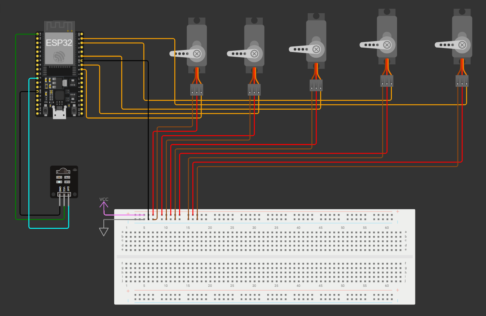

# 5-DOF Pick-and-Place Robotic Arm

An ESP32-based robotic arm project that detects objects with an IR sensor, picks them up with a gripper, and places them into six predefined slots. The project also includes a serial-console sketch for calibrating each servo angle.

## Features

- Smooth control of base, shoulder, elbow, and gripper servos
- IR sensor object detection with debounce and sensor-clear handling
- Automatic pick-and-place sequence for six slots
- Serial status messages at 115200 baud
- Manual servo angle tuning from the Serial Monitor
- Wokwi circuit definition and diagram

## Project Files

| File | Purpose |
| --- | --- |
| `Pick_Place.ino` | Main automatic pick-and-place program |
| `Angle_tuning.ino` | Manual servo calibration program |
| `Circuit.json` | Wokwi circuit configuration |
| `Circuit_diagram.png` | Circuit diagram image |

## Hardware

- ESP32 development board
- Four servo motors:
  - Base
  - Shoulder
  - Elbow
  - Gripper
- Digital IR obstacle/object sensor
- External 5 V supply suitable for the servos
- Common ground between the ESP32 and servo power supply

## Pin Configuration

The pin assignments used by the Arduino sketches are:

| Component | ESP32 GPIO |
| --- | ---: |
| Base servo signal | 18 |
| Shoulder servo signal | 19 |
| Elbow servo signal | 21 |
| Gripper servo signal | 23 |
| IR sensor output | 22 |
| IR sensor VCC | 3V3 |
| ESP32 serial monitor | USB serial |

Servo power should come from an appropriate external supply. Connect the external supply ground to ESP32 GND. Do not power several servos from the ESP32 3.3 V pin.

## Software Setup

1. Install the ESP32 board package in Arduino IDE.
2. Install the `ESP32Servo` library.
3. Select the correct ESP32 board and COM port.
4. Connect the hardware with the pin assignments above.
5. Upload `Angle_tuning.ino` first to calibrate the servos.
6. Upload `Pick_Place.ino` after verifying the safe positions.

Both sketches use a servo pulse range of 500 to 2500 microseconds and a 50 Hz refresh rate.

## Servo Calibration

Open the Serial Monitor with:

- Baud rate: `115200`
- Line ending: `Newline`

The calibration sketch starts all servos at 90 degrees. Enter these commands:

| Command | Action |
| --- | --- |
| `b` | Select base servo |
| `s` | Select shoulder servo |
| `e` | Select elbow servo |
| `g` | Select gripper servo |
| `+` / `-` | Increase or decrease the selected servo angle |
| `step1` | Move by 1 degree |
| `step5` | Move by 5 degrees |
| `step10` | Move by 10 degrees |
| `b90` | Set base directly to 90 degrees |
| `s100` | Set shoulder directly to 100 degrees |
| `e75` | Set elbow directly to 75 degrees |
| `g30` | Set gripper directly to 30 degrees |
| `status` | Print all current angles |
| `help` | Print the command list |

The sketch constrains all requested angles to the range 0-180 degrees. Record safe angles for the arm's mechanical limits before using automatic motion.

## Automatic Operation

After startup, `Pick_Place.ino` moves the arm to its start position and waits for the IR sensor to detect an object.

For each detected object, the arm:

1. Opens the gripper.
2. Moves to the pick position.
3. Closes the gripper.
4. Retracts with the object.
5. Rotates toward the next slot.
6. Lowers the object into the slot.
7. Releases the object.
8. Retracts and returns to the start position.

The routine fills slots 1 through 6 in order and stops after slot 6. The next object is accepted only after the previous object has cleared the IR sensor.

## Default Positions

The main sketch contains the tested positions for the current arm build:

- Start: base 90, shoulder 90, elbow 90
- Pick: base 90, shoulder 45, elbow 95
- Gripper start/open value: 10
- Gripper release value: 20
- Gripper hold/closed value: 60

These values are mechanical calibration values, not universal servo angles. Adjust them with `Angle_tuning.ino` if the arm geometry or servo installation changes.

## Wokwi Circuit Note

The current `Circuit.json` includes five servo components. It also connects one servo signal to GPIO 22, while the sketches use GPIO 22 for the IR sensor and define only four servo objects. For the circuit to match the sketches, remove or reassign the extra servo on GPIO 22 and connect the IR sensor data line to GPIO 22.

## Safety

- Test with the arm unloaded and at low speed first.
- Keep hands clear of moving joints and the gripper.
- Use a regulated power supply sized for the stall current of all servos.
- Confirm the start, pick, and slot positions do not drive the mechanism into a hard stop.
- Disconnect power before changing wiring.
